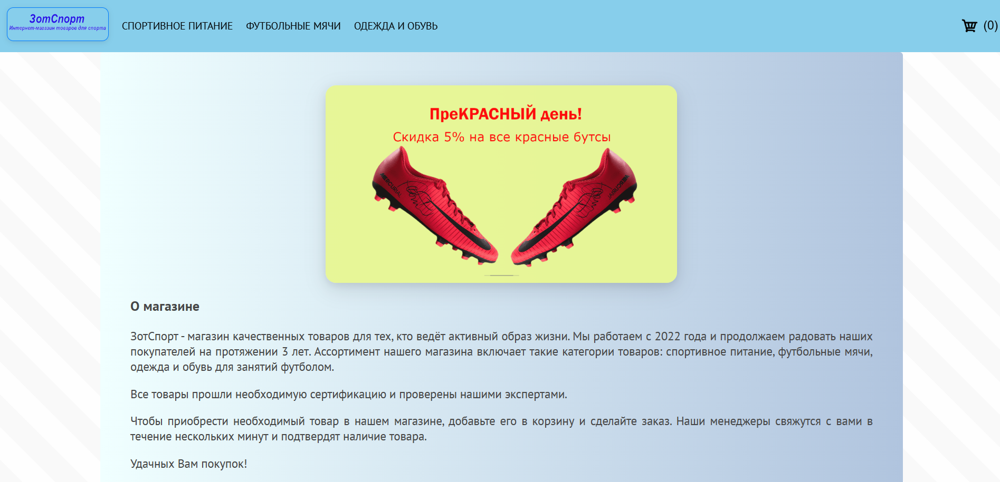
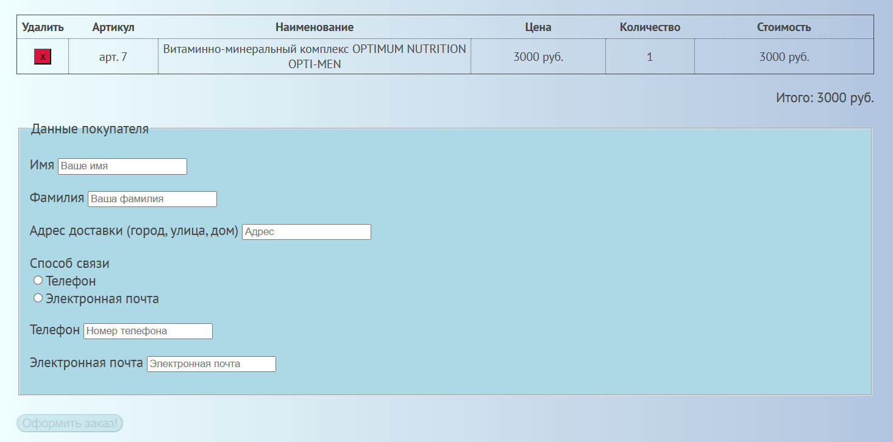
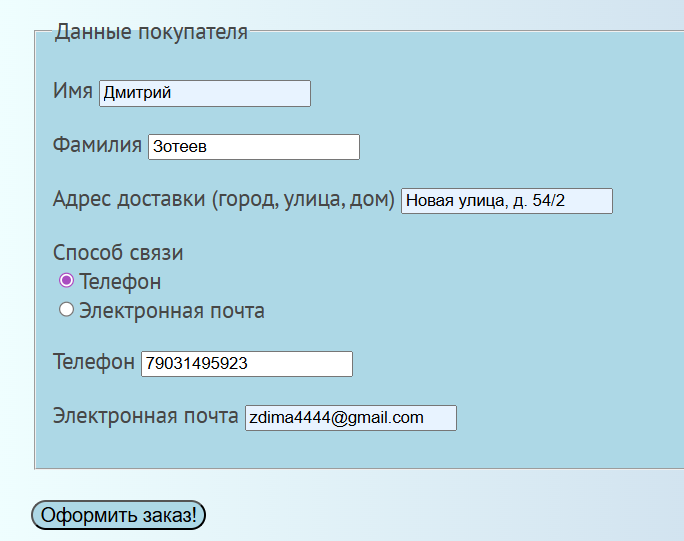
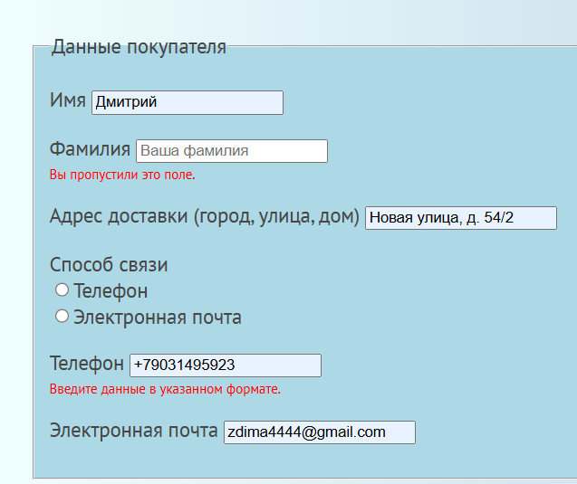
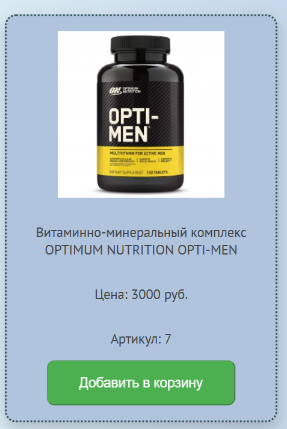
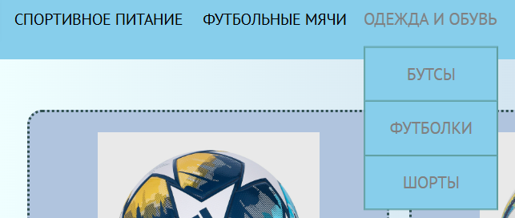
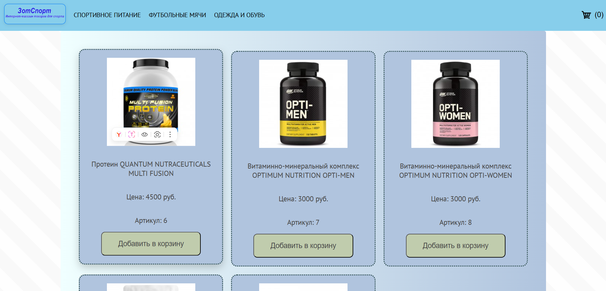

# Название проекта

ЗотСпорт. Интернет-магазин спортивных товаров

# Общее описание

Проект изначально начинался как сайт на чистом HTML/CSS/JS + PHP/SQLite, а сейчас используется современный стек с React и Vite.

### Основные возможности

- Каталог товаров с фильтрацией по категориям и брендам
- Корзина с сохранением в localStorage
- Форма заказа с динамическим формированием содержимого (передача в PHP, отправка сообщений на электронную почту)
- Панель администратора (вход, добавление/редактирование/удаление товаров)
- Адаптивный дизайн
- Поддержка Docker

### Используемые технологии

- HTML, CSS
- JS
- SQLite
- PHP
- React v.19.2.0
- React Router v.7.12.0
- Vite v.7.2.4
- Docker + Docker Compose

# Как запустить проект

Клонировать репозиторий.
Находясь в корневой папке проекта, выполнить команду

```
docker-compose up -d
```

## Скриншоты

### Главная страница



### Корзина



### Форма оформления заказа




### Карточка товара при добавлении в корзину



### Меню



### Список товаров


